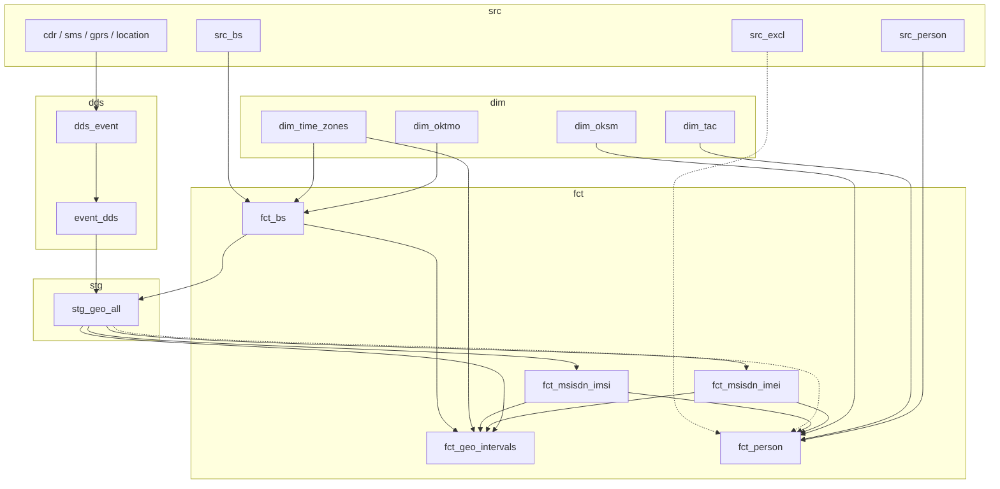

# Mobile OSS — локальные пайплайны

Репозиторий **mobile** — офлайн-конвейер для разработки и проверки мобильной аналитики: синтетические **src**-витрины (абоненты, БС, CDR/SMS/GPRS/location), справочники, события, гео-агрегаты, привязки MSISDN↔IMSI/IMEI, профили физлиц и контроль качества. Каждый шаг — CLI-команда `uv run mobile <команда>`; для витрин обычно три фазы: **build** → **dq** → **nb** (ноутбук с метриками DQ и профилем parquet). Артефакты пишутся в `data/` (parquet, логи `data/logs/mobile.log`, тайминги `data/qa/command_timing.jsonl`). Спецификации шагов — в `documents/` (build по слоям: `dim/`, `src/`, `dds/`, `fct/`, `stg/`; DQ — `documents/dq/{слой}/`), исходники — в `src/mobile/pipelines/` (`{dim,dds,fct,stg,src}/`, `dq/{слой}/`, общие хелперы — `common/`).

**Слои по префиксу команды:** `dim-*` — справочники (ОКТМО, TAC, …); `src-*` — синтетические исходники; `dds-*` — детальный слой событий (`dds_event`); `fct-*` — витрины-факты (БС, привязки, интервалы, person); `build-stg-geo-all` / `dq-stg-geo-all` / `nb-stg-geo-all` — промежуточная дневная гео-агрегация (`stg_geo_all`). Префикс в имени команды совпадает с каталогом артефактов под `data/` (`dim/`, `src/`, `dds/`, `fct/`, …).

## Общие пайплайны

Сквозные команды, не привязанные к одной витрине. Порядок шагов задаётся в коде ([`cli.py`](src/mobile/cli.py): `RUN_SRC_COMMANDS`, `RUN_ALL_COMMANDS`, `BUILD_PROD_STAGE1_*`, `BUILD_PROD_STAGE2_*`, `BUILD_PROD_PERSON_*`). Прод-расписание — [`documents/pipelines/prod_run_order.md`](documents/pipelines/prod_run_order.md).

| Команда | Описание | Параметры |
| ------- | -------- | --------- |
| `run-src` | Только **build** src-слоя: `build-dim-oktmo` → `build-src-bs` → `build-src-person` → `build-src-excl` → `build-src-mobile` (5 шагов). Без `dq-src-*` и `nb-src-*`. В `run-all` эти команды по-прежнему идут по отдельности (13–24). | опционально `--target-per-operator`, `--excl-pct-of-ab` |
| `run-all` | Последовательно выполняет команды **1–47** из таблицы ниже — те же дефолты, что при одиночном вызове без флагов. `build-fct-person` запускается **по каждому календарному месяцу** в окне `DEFAULT_SRC_*` (сейчас 3 прогона). При ошибке на шаге прогон останавливается; в логе — `run-all [i/n] <команда>`. | опционально `--target-per-operator`, `--excl-pct-of-ab` (передаются в `build-src-person` / `build-src-excl`) |
| `build-prod-stage1` | Прод **stage 1** (ежедневно): `dq-src-mobile` → `build-dds-event` (× ЦОД) → `build-dds-move-event`. На проде перенос (`build-dds-move-event`) — **вручную** поставщиком, см. prod_run_order. | **`--report-date`** (обязателен); опционально `--dc`, пути mobile-витрин |
| `build-prod-stage2` | Прод **stage 2** (ежедневно): dim ОКТМО/time zones, `dq-src-bs` → `fct_bs`, `dq-dds-event`, `stg_geo_all`, binding IMEI/IMSI, `fct_geo_intervals` (16 шагов). После stage 1. | **`--report-date`** (обязателен); опционально пути справочников и витрин (как у одиночных команд) |
| `build-prod-person` | Прод **person** (1-го числа месяца): TAC, ОКСМ, `dq-src-excl`, `dq-src-person`, `build-fct-person`, `dq-fct-person` за **прошлый** месяц (8 шагов). | `--report-date` = `YYYY-MM-01` (опционально; без флага — предыдущий месяц) |
| `update-readme-stats` | Пересчёт раздела **Статистика** в README по текущему дереву `src/mobile/`, `documents/`, `data/` | — |

```bash
uv run mobile run-src
uv run mobile run-all
uv run mobile build-prod-stage1 --report-date 2025-01-15
uv run mobile build-prod-stage2 --report-date 2025-01-15
uv run mobile build-prod-person
uv run mobile build-prod-person --report-date 2025-01-01
uv run mobile update-readme-stats
```

## Список команд и параметров

| Номер команды | Команда              | Описание                                             | Параметры                                                                               | Ссылка на документацию                            |
| ------------- | -------------------- | ---------------------------------------------------- | --------------------------------------------------------------------------------------- | ------------------------------------------------- |
| 1             | build-dim-oktmo      | Генерация справочника ОКМО                           | --csv-path src/mobile/raw_data/oktmo_v001.csv --output-path data/dim/oktmo.parquet      | [Документ](documents/dim/build_dim_oktmo.md)      |
| 2             | dq-dim-oktmo         | Проверка качества сгенерированного справочника ОКТМО | --oktmo-path data/dim/oktmo.parquet                                                     | [Документ](documents/dq/dim/dq_dim_oktmo.md)      |
| 3             | nb-dim-oktmo         | Визуализация метрик DQ проверок и справочника ОКТМО  | —                                                                                       | [Ноутбук](src/mobile/pipelines/nb/1_dim_oktmo.ipynb) |
| 4             | build-dim-time-zones | Генерация справочника часовых поясов                 | --csv-path src/mobile/raw_data/time_zones.csv --output-path data/dim/time_zones.parquet | [Документ](documents/dim/build_dim_time_zones.md) |
| 5             | dq-dim-time-zones    | Проверка качества справочника часовых поясов         | --time-zones-path data/dim/time_zones.parquet                                           | [Документ](documents/dq/dim/dq_dim_time_zones.md) |
| 6             | nb-dim-time-zones    | Визуализация метрик DQ и карта таймзон               | —                                                                                       | [Ноутбук](src/mobile/pipelines/nb/2_dim_time_zones.ipynb) |
| 7             | build-dim-tac        | Генерация справочника TAC                            | --csv-path src/mobile/raw_data/tacdb_v001.csv --output-path data/dim/tac.parquet        | [Документ](documents/dim/build_dim_tac.md)        |
| 8             | dq-dim-tac           | Проверка качества справочника TAC                    | --tac-path data/dim/tac.parquet                                                         | [Документ](documents/dq/dim/dq_dim_tac.md)        |
| 9             | nb-dim-tac           | Визуализация метрик DQ и сводка справочника TAC      | —                                                                                       | [Ноутбук](src/mobile/pipelines/nb/3_dim_tac.ipynb) |
| 10            | build-dim-oksm       | Генерация справочника ОКСМ                           | --csv-path src/mobile/raw_data/oksm_v001.csv --output-path data/dim/oksm.parquet        | [Документ](documents/dim/build_dim_oksm.md)       |
| 11            | dq-dim-oksm          | Проверка качества справочника ОКСМ                   | --oksm-path data/dim/oksm.parquet                                                       | [Документ](documents/dq/dim/dq_dim_oksm.md)       |
| 12            | nb-dim-oksm          | Визуализация метрик DQ и сводка справочника ОКСМ     | —                                                                                       | [Ноутбук](src/mobile/pipelines/nb/4_dim_oksm.ipynb) |
| 13            | build-src-bs         | Генерация синтетического справочника базовых станций | —                                                                                       | [Документ](documents/src/build_src_bs.md)         |
| 14            | dq-src-bs            | Проверка качества справочника базовых станций        | --src-bs-path data/src/bs.parquet                                                       | [Документ](documents/dq/src/dq_src_bs.md)         |
| 15            | nb-src-bs            | Визуализация метрик DQ и карта базовых станций       | —                                                                                       | [Ноутбук](src/mobile/pipelines/nb/5_src_bs.ipynb) |
| 16            | build-src-person     | Генерация синтетической витрины абонентов            | --target-per-operator 50000                                                             | [Документ](documents/src/build_src_person.md)     |
| 17            | dq-src-person        | Проверка качества витрины абонентов (3 прохода по месяцам) | `--start-date` + `--src-person-path` (обязательны); без флагов — 3 прохода за DEFAULT_SRC_* | [Документ](documents/dq/src/dq_src_person.md)     |
| 18            | nb-src-person        | Визуализация метрик DQ витрины абонентов             | —                                                                                       | [Ноутбук](src/mobile/pipelines/nb/6_src_person.ipynb) |
| 19            | build-src-excl       | Генерация списков исключений (IMSI, IMEI, MSISDN)    | —                                                                                       | [Документ](documents/src/build_src_excl.md)       |
| 20            | dq-src-excl          | Проверка качества списков исключений                 | --src-imsi-path data/src/excl/src_imsi.parquet --src-imei-path data/src/excl/src_imei.parquet --src-msisdn-path data/src/excl/src_msisdn.parquet | [Документ](documents/dq/src/dq_src_excl.md)       |
| 21            | nb-src-excl          | Визуализация метрик DQ списков исключений            | —                                                                                       | [Ноутбук](src/mobile/pipelines/nb/7_src_excl.ipynb) |
| 22            | build-src-mobile     | Генерация синтетических mobile-витрин (CDR, SMS, GPRS, location) | —                                                                                       | [Документ](documents/src/build_src_mobile.md)     |
| 23            | dq-src-mobile        | Проверка качества mobile-витрин (день × ЦОД)         | `--report-date` + 4 пути витрин; без флагов — DEFAULT_SRC_* × central/far-east         | [Документ](documents/dq/src/dq_src_mobile.md)     |
| 24            | nb-src-mobile        | Визуализация метрик DQ mobile-витрин                 | —                                                                                       | [Ноутбук](src/mobile/pipelines/nb/8_src_mobile.ipynb) |
| 25            | build-dds-event      | Сборка дневной витрины dds_event из mobile-витрин    | 5 параметров (`--report-date`, 4 витрины, `--output-path`); без флагов — DEFAULT_SRC_* × ЦОД (2 subprocess/ЦОД) | [Документ](documents/dds/build_dds_event.md)      |
| 26            | build-dds-move-event     | Перенос dds_event в DDS-layout (локальная заглушка)  | `--report-date`; без флагов — DEFAULT_SRC_*; на проде — ручной перенос поставщиком      | [Документ](documents/dds/build_dds_move_event.md)   |
| 27            | dq-dds-event         | Проверка качества DDS-среза dds_event                | `--report-date` + `--event-dds-path` (каталог); без флагов — DEFAULT_SRC_* по дням      | [Документ](documents/dq/dds/dq_dds_event.md)        |
| 28            | nb-dds-event         | Визуализация метрик DQ DDS-среза dds_event           | —                                                                                       | [Ноутбук](src/mobile/pipelines/nb/9_dds_event.ipynb) |
| 29            | build-fct-bs         | Сборка исторической витрины fct_bs из src_bs         | 4 параметра (`--src-bs-path`, `--oktmo-path`, `--time-zones-path`, `--output-path`); без флагов — пути по умолчанию | [Документ](documents/fct/build_fct_bs.md)         |
| 30            | dq-fct-bs            | Проверка качества витрины fct_bs                     | `--fct-bs-path` (по умолчанию `data/fct/bs.parquet`)                                   | [Документ](documents/dq/fct/dq_fct_bs.md)         |
| 31            | nb-fct-bs            | Визуализация метрик DQ витрины fct_bs                | —                                                                                       | [Ноутбук](src/mobile/pipelines/nb/10_fct_bs.ipynb) |
| 32            | build-stg-geo-all    | Сборка дневной витрины stg_geo_all из event_dds + fct_bs | 4 параметра (`--report-date`, `--event-dds-path`, `--fct-bs-path`, `--output-path`); без флагов — DEFAULT_SRC_* по дням | [Документ](documents/stg/build_stg_geo_all.md)    |
| 33            | dq-stg-geo-all       | Проверка качества дневной витрины stg_geo_all          | 2 параметра (`--report-date`, `--stg-geo-all-path`); без флагов — DEFAULT_SRC_* по дням | [Документ](documents/dq/stg/dq_stg_geo_all.md)    |
| 34            | nb-stg-geo-all       | Визуализация метрик DQ витрины stg_geo_all             | —                                                                                       | [Ноутбук](src/mobile/pipelines/nb/11_stg_geo_all.ipynb) |
| 35            | build-fct-msisdn-imei | Сборка месячной витрины fct_msisdn_imei из stg_geo_all | 3 параметра (`--report-date`, `--stg-geo-all-path`, `--output-path`); без флагов — DEFAULT_SRC_* по дням с geo_all | [Документ](documents/fct/build_fct_msisdn_imei.md) |
| 36            | dq-fct-msisdn-imei    | Проверка качества месячной витрины fct_msisdn_imei     | `--report-date` (любой день → YYYY-MM-01) + `--fct-msisdn-imei-path`; без флагов — DEFAULT_SRC_* по месяцам | [Документ](documents/dq/fct/dq_fct_msisdn_imei.md) |
| 37            | nb-fct-msisdn-imei    | Визуализация метрик DQ витрины fct_msisdn_imei         | —                                                                                       | [Ноутбук](src/mobile/pipelines/nb/12_fct_msisdn_imei.ipynb) |
| 38            | build-fct-msisdn-imsi-operator | Сборка fct_msisdn_imsi из stg_geo_all (IMSI + operator_id из MNC) | 3 параметра (`--report-date`, `--stg-geo-all-path`, `--output-path`); без флагов — DEFAULT_SRC_* | [Документ](documents/fct/build_fct_msisdn_imsi_operator.md) |
| 39            | dq-fct-msisdn-imsi-operator | Проверка качества месячной витрины fct_msisdn_imsi | `--report-date` (любой день → YYYY-MM-01) + `--fct-msisdn-imsi-path`; без флагов — DEFAULT_SRC_* по месяцам | [Документ](documents/dq/fct/dq_fct_msisdn_imsi_operator.md) |
| 40            | nb-fct-msisdn-imsi-operator | Визуализация метрик DQ витрины fct_msisdn_imsi      | —                                                                                       | [Ноутбук](src/mobile/pipelines/nb/13_fct_msisdn_imsi_operator.ipynb) |
| 41            | build-fct-geo-intervals | Сборка дневной витрины fct_geo_intervals (интервалы пребывания из stg_geo_all) | 7 параметров (`--report-date`, `--stg-geo-all-path`, `--fct-bs-path`, `--time-zones-path`, `--fct-msisdn-imsi-path`, `--fct-msisdn-imei-path`, `--output-path`); без флагов — DEFAULT_SRC_* по дням | [Документ](documents/fct/build_fct_geo_intervals.md) |
| 42            | dq-fct-geo-intervals | Проверка качества дневной витрины fct_geo_intervals | 2 параметра (`--report-date`, `--fct-geo-intervals-path`); без флагов — DEFAULT_SRC_* по дням | [Документ](documents/dq/fct/dq_fct_geo_intervals.md) |
| 43            | nb-fct-geo-intervals | Визуализация метрик DQ витрины fct_geo_intervals | —                                                                                       | [Ноутбук](src/mobile/pipelines/nb/14_fct_geo_intervals.ipynb) |
| 44            | build-fct-person | Сборка месячной витрины fct_person (профиль физлиц, кластеризация, binding MSISDN↔IMSI/IMEI) | 10 параметров (`--report-date` = YYYY-MM-01, …); без `--report-date` — по каждому месяцу в `DEFAULT_SRC_*` (как в `run-all`); внутри — синхронизация месячных binding из `stg_geo_all` | [Документ](documents/fct/build_fct_person.md) |
| 45            | dq-fct-person | Проверка качества месячной витрины fct_person | 2 параметра (`--report-date`, `--fct-person-path`); без флагов — DEFAULT_SRC_* по месяцам с существующим parquet | [Документ](documents/dq/fct/dq_fct_person.md) |
| 46            | nb-fct-person | Визуализация метрик DQ витрины fct_person | — | [Ноутбук](src/mobile/pipelines/nb/15_fct_person.ipynb) |
| 47            | nb-perf-metrics | Сводка wall-time команд из `data/qa/command_timing.jsonl` | — | [Ноутбук](src/mobile/pipelines/nb/perf_metrics.ipynb) |

---

## Data lineage

Сводка **по витринам** (куда пишем parquet, откуда поля). Имена полей **src** (Person, ОСС CDR/SMS/GPRS/location, БС) — по [`geo/internal_docs/shema_table.pdf`](../geo/internal_docs/shema_table.pdf) (приложение 1); в репозитории — [`src/mobile/schema/`](src/mobile/schema/). Производные слои (`dds_*`, `stg_*`, `fct_*`, `dim_*`) — внутренние контракты ETL. Детальные алгоритмы — в `documents/**/build_*.md`. Порядок prod — [`documents/pipelines/prod_run_order.md`](documents/pipelines/prod_run_order.md).



### `dim_*` — справочники

| Витрина | Путь | Источник | Поля (выход) | Маппинг |
| ------- | ---- | -------- | ------------ | ------- |
| `dim_oktmo` | `data/dim/oktmo.parquet` | `src/mobile/raw_data/oktmo_v001.csv` | `WKT`, `level`, `parent_code`, `code`, `name` | CSV 1:1 |
| `dim_time_zones` | `data/dim/time_zones.parquet` | `raw_data/time_zones.csv` | `code`, `name`, `timezone`, `geometry` | CSV 1:1 |
| `dim_tac` | `data/dim/tac.parquet` | `raw_data/tacdb_v001.csv` | `tac`, `manufacturer`, `model_name`, `marketing_name`, `equipment_type`, `radio_technology`, `sim_form_factor`, `allocation_date`, `reporting_body`, `chipset`, `comment`, `is_m2m` | 11 колонок CSV 1:1; `is_m2m` ← `equipment_type` (M2M/IoT) |
| `dim_oksm` | `data/dim/oksm.parquet` | `raw_data/oksm_v001.csv` | `numeric_code`, `name_short`, `name_full`, `alpha2`, `alpha3`, `autokey` | колонки CSV → одноимённые поля |

Схемы: [`dim/oktmo.json`](src/mobile/schema/dim/oktmo.json), [`time_zones.json`](src/mobile/schema/dim/time_zones.json), [`tac.json`](src/mobile/schema/dim/tac.json), [`oksm.json`](src/mobile/schema/dim/oksm.json).

### `src_*` — синтетические и внешние источники

| Витрина | Путь | Источник | Ключевые поля | Куда идут |
| ------- | ---- | -------- | ------------- | --------- |
| `src_bs` | `data/src/bs.parquet` | синтез [`build-src-bs`](documents/src/build_src_bs.md) | `mcc`, `mnc`, `lac`, `cell`, `date_on`, `date_off`, `coord_x`, `coord_y`, `generation`, `bs_type`, … ([`src/bs.json`](src/mobile/schema/src/bs.json)) | → `fct_bs` |
| `src_person` | `data/src/person/load_day=*/person.parquet` | синтез / поставка | профиль: `isdn`, `imsi`, `imei`, `iccid`, `actually_from`/`to`, ФИО, документы, … ([`src/person.json`](src/mobile/schema/src/person.json), 99 полей) | → `fct_person` |
| `src_imsi` / `src_imei` / `src_msisdn` | `data/src/excl/src_*.parquet` | синтез | `value` | фильтр в `fct_person` |
| `cdr` | `data/src/mobile/{dc}/operator/cdr/.../10001/{YYYY}/{MM}/{DD}/` | синтез mobile | `Started`, `IMSI`, `IMEI`, `CallingNumber`, `OwnerMCCMNC`, `BSStartLac`, `BSStartCell`, … | → `dds_event` |
| `sms` | `.../10002/...` | синтез | `Started`, `Calling`, `IMSI`, `MCC`, `MNC`, `Lac`, `Cell`, … | → `dds_event` |
| `gprs` | `.../10003/...` | синтез | `Started`, `CallingNumber`, `IMSI`, `OwnerMCCMNC`, `BSStartLac`, `BSStartCell`, … | → `dds_event` |
| `location` | `.../10004/...` | синтез | `Started`, `Served`, `IMSI`, `MCC`, `MNC`, `Lac`, `Cell`, … | → `dds_event` |

### `dds_*` — события

| Витрина | Путь | Входы | Поля | Маппинг (сводка) |
| ------- | ---- | ----- | ---- | ---------------- |
| `dds_event` | `data/dds/event/{YYYY}/{MM}/{DD}/{dc}/events.parquet` | 4 mobile-витрины × ЦОД | `event_timestamp`, `imsi`, `imei`, `msisdn`, `location{mcc,mnc,lac,cell}`, `event`, `event_name`, `event_count` | `Started`→`event_timestamp`; `IMSI`/`IMEI`; MSISDN из `CallingNumber`/`Calling`/`Served`; CGI из MCC/MNC/LAC/Cell; код витрины → `event`/`event_name`; 5m-схлопывание → `event_count` |
| `event_dds` | `data/dds/event_dds/{YYYY-MM-DD}/{dc}.parquet` | `dds_event` | те же 8 полей | копия 1:1 (prod — поставщик) |

Схема: [`dds/event.json`](src/mobile/schema/dds/event.json). Спеки: [`build_dds_event.md`](documents/dds/build_dds_event.md), [`build_dds_move_event.md`](documents/dds/build_dds_move_event.md).

### `stg_*` — промежуточный геослой

| Витрина | Путь | Входы | Поля | Маппинг (сводка) |
| ------- | ---- | ----- | ---- | ---------------- |
| `stg_geo_all` | `data/stg/geo_all/{YYYY-MM-DD}.parquet` | `event_dds`, `fct_bs` | `msisdn`, `imsi`, `imei`, `start_time_utc`, `end_time_utc`, `utc_offset`, `lat`, `lon`, `bs_type`, `cgi`, `event_count`, `source_event_type`, `oktmo_code_1`, `oktmo_code_2` | IDs из `event_dds`; `cgi` из `location`; join `fct_bs` по `cgi`+интервал → координаты, `utc_offset`, ОКТМО; UTC-срез дня; 5m-агрегация |

Схема: [`stg/geo_all.json`](src/mobile/schema/stg/geo_all.json). Спека: [`build_stg_geo_all.md`](documents/stg/build_stg_geo_all.md).

### `fct_*` — витрины-факты

| Витрина | Путь | Входы | Поля | Маппинг (сводка) |
| ------- | ---- | ----- | ---- | ---------------- |
| `fct_bs` | `data/fct/bs.parquet` | `src_bs`, `dim_oktmo`, `dim_time_zones` | `mcc`, `mnc`, `lac`, `cell_id`, `telecomstandard`, `frequency`, `lon`, `lat`, `bs_type`, `sector_*`, `h3`, `timezone`, `mapinfo_wkt*`, `sector_wkt*`, `oktmo_code_1/2`, `date_on`, `date_off` (28) | `cell`→`cell_id`; generation→`telecomstandard`; coords→`lon`/`lat`; pip → `timezone`, ОКТМО; Voronoi/сектор; SCD Type 2 |
| `fct_msisdn_imei` | `data/fct/msisdn_imei/{YYYY-MM-01}.parquet` | `stg_geo_all` (по дням месяца) | `msisdn`, `imei`, `valid_from`, `valid_to` | сегменты при смене IMEI, clip к дню, merge |
| `fct_msisdn_imsi` | `data/fct/msisdn_imsi/{YYYY-MM-01}.parquet` | `stg_geo_all` | `msisdn`, `imsi`, `operator_id`, `valid_from`, `valid_to` | сегменты при смене IMSI; `operator_id` из `imsi[3:5]` при MCC=250 |
| `fct_geo_intervals` | `data/fct/geo_intervals/{YYYY-MM-DD}.parquet` | `stg_geo_all`, `fct_bs`, `dim_time_zones`, `fct_msisdn_imsi`, `fct_msisdn_imei` | `msisdn`, `imsi`, `imei`, `start_time_utc`, `end_time_utc`, `cgi_list`, `sub_lat`, `sub_lon`, `bs_type`, `timezone`, `oktmo_code_1`, `oktmo_code_2`, `time_key` | интервалы 5m/30m; fill `imsi`/`imei` из binding; weighted centroid; `time_key`=report_date |
| `fct_person` | `data/fct/person/{YYYY-MM-01}.parquet` | `src_person`, `fct_msisdn_*`, `dim_tac`, `dim_oksm`, `src_excl`, prior `fct_person`, опц. `stg_geo_all` | `report_date`, `person_id`, `person_cluster_key`, `person_confidence`, `sim_count`, `msisdn`, `imsi`, `imei`, `gender`, `age`, `citizenship`, `operator_id`, `actually_from`, `actually_to` | union-find (bio/iccid/ID/binding); `person_id` стабилен; primary SIM; `citizenship`←`dim_oksm` |

Схемы: [`fct/bs.json`](src/mobile/schema/fct/bs.json), [`msisdn_imei.json`](src/mobile/schema/fct/msisdn_imei.json), [`msisdn_imsi.json`](src/mobile/schema/fct/msisdn_imsi.json), [`geo_intervals.json`](src/mobile/schema/fct/geo_intervals.json), [`person.json`](src/mobile/schema/fct/person.json).

---

## Статистика


<!-- readme-stats:begin -->

Оценка по дереву `src/mobile/`, `documents/` и `README.md` (без `data/`, `__pycache__`, `.git`). Числа округлены; после локальных прогонов меняются артефакты в `data/`. Обновить: `uv run mobile update-readme-stats`.

### Код

| Метрика | Значение |
| -------- | -------- |
| Python-модули (`src/mobile`) | **58** файлов |
| Строки Python (всего) | **~26 600** (~23 500 непустых) |
| Функции / классы (AST) | **891** / **15** |
| ETL `pipelines/{dim,dds,fct,stg}` | dim 4 · dds 2 · fct 6 · stg 1, ~5 100 строк |
| Общее `pipelines/common` | 7 модулей, 471 строк (DQ-логи, gates, WKT, CSV, схемы, binding-интервалы) |
| Синтез `pipelines/src` | 4 модуля, ~7 500 строк (крупнейший — `mobile.py`, 5 000 строк) |
| DQ `pipelines/dq/{dim,dds,fct,stg,src}` | 15 модулей, ~5 600 строк |
| Ноутбуки `pipelines/nb/common.py` | ~3 900 строк (DQ-дашборды, folium) |
| CLI, пути, timing | `cli.py`, `project_paths.py`, … — ~4 000 строк |
| JSON-схемы витрин | **20** файлов в `schema/` |

### Документация

| Метрика | Значение |
| -------- | -------- |
| Markdown-спеки | **32** файл в `documents/` + **README** |
| Строки документации | **~6 000** (~4 100 непустых) |
| `documents/{dim,dds,fct,stg}` — build | 4 / 2 / 5 / 1 |
| `documents/dq/{dim,dds,fct,stg}` — dq | 4 / 1 / 5 / 1 |
| `documents/src` — build / dq | 4 / 4 |
| Исходные DQ-ноутбуки | **16** `.ipynb` в `pipelines/nb/` (~2 500 строк JSON) |

### CLI и пайплайны

| Метрика | Значение |
| -------- | -------- |
| Зарегистрированных команд | **53** (`47` по таблице + `run-all` + `run-src` + `build-prod-stage1` + `build-prod-stage2` + `build-prod-person` + `update-readme-stats`) |
| Шагов в `run-all` | **47** (+ до 3× `build-fct-person` по месяцам → до **49** subprocess) |
| Шагов в `run-src` | **5** (только build: ОКТМО + 4 src-витрины) |
| Календарное окно синтеза | `DEFAULT_SRC_*`: **2024-12-25 … 2025-02-05** |
| Операторы / ЦОД в синтезе | **4** MNO, **2** ЦОД (`central`, `far-east`) |

### Локальные артефакты (после прогонов)

| Метрика | Значение |
| -------- | -------- |
| Parquet в `data/` | **1 738** файлов (зависит от полноты `run-all` / `run-src`) |
| Executed notebooks | **16+** в `data/notebooks/` |
| Метрики времени | `data/qa/command_timing.jsonl` |
| Логи | `data/logs/mobile.log` |

<!-- readme-stats:end -->

